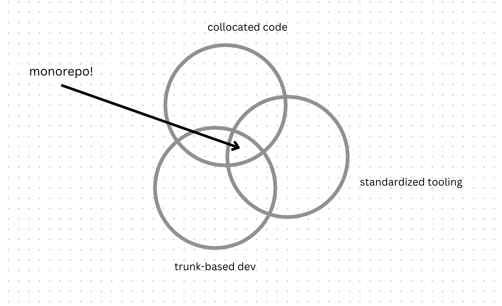

# Journey to the monorepo

> [illustration: treasure map showing path from startup -> monolith -> micro repos -> monorepo]

Content: roughly https://rushjs.io/pages/intro/why_mono/, with a few tweaks.

